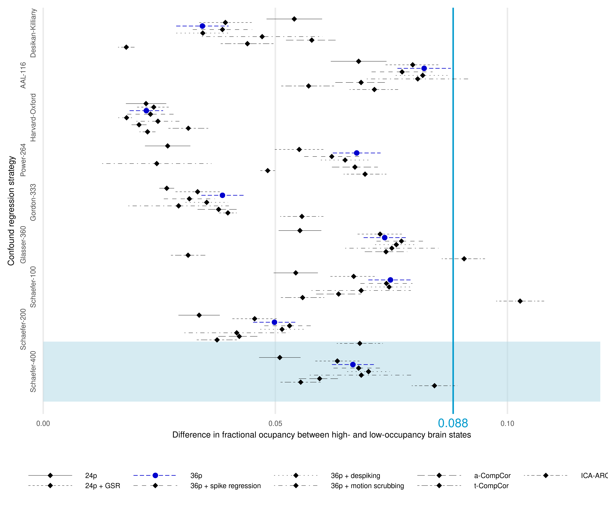

In this repository we present the statistical analysis pipeline for a proposed replication of the main effects reported in [Schlemm et al, 2022](https://doi.org/10.1016/j.biopsych.2022.03.019). For illustration, we will use the pipeline to re-analyse data from the first 1000 imaging subjects of the Hamburg City Health Study (HCHS), while the replication analysis will be based on an independent sample of approximately 1500 HCHS subjects.

# MRI data preprocessing,  white matter lesion segmentation and covariates
We assume that structural and functional MR imaging data have been quality assessed and processed using FreeSurfer, sMRIprep, and fMRIprep. We also assume that [xcpEngine](https://github.com/PennLINC/xcpEngine) output is available as

`
./derivatives/xcpengine/{design}/sub-{subjectID}/fcon/{atlas}/sub-{subjectID}_{atlas}_ts.1D
`

In [Schlemm et al, 2022](https://doi.org/10.1016/j.biopsych.2022.03.019), we used the '36p' confound regression strategy and the 'schaefer400' atlas. In the following multiverse analysis, we will use additional regression strategies and brain parcellations, namely

`
24p, 24p_gsr, 36p_spkreg, 36p_despike, 36p_scrub, aCompCor, tCompCpr, aroma
`

and

`
Desikan-Killiany, AAL-116, Harvard-Oxford, Power-264, Gordon-333, Glasser-360, Schaefer-100, Schaefer-200
`

We will further assume that white matter hyperintensity volumes (total, deep and periventricular) are available in [derivatives/WMH/cSVD.csv](./../../../derivatives/WMH/cSVD.csv).

Covariates age, gender and years of education are imported from [input/hchs.csv](./../../../input/hchs.csv).

# Brain state estimation
k=5 discrete brain states are estimated by clustering BOLD-signals in brain activation space. We use the `kmeans` algorithm implemented in Matlab with the Pearson correlation as distance measure. The relevant code is given in [analysis/code/Matlab/clustering.m](./../Matlab/clustering.m). The script produces subject-specific estimates of fractional occupancies of five brain states, ordered by average fractional occupancy. These are saved as

`
./analysis/derivatives/data/dFCmetrics~{design}~{atlas}~.dat
`

# Statistical analysis

## Data import and preprocessing


```r
source('.Rprofile', chdir = TRUE)
#source('prepdata.r')
load('data.Rdata')
```


## Check for separation between high- and low occupancy states

We use paired t-tests to compare average fractional occupancy in the two high-occupancy states with the average occupancy in the three low-occupancy states.

```r
d.tt <- d.dFC %>% 
  nest() %>% 
  mutate(t.out = map(data, ~t.test(.$FO.high, .$FO.low, paired = TRUE))
         , estimate = map_dbl(t.out, ~.$estimate)
         , p.value = map_dbl(t.out, ~.$p.value)
         , conf.low = map_dbl(t.out, ~.$conf.int[[1]])
         , conf.high = map_dbl(t.out, ~.$conf.int[[2]])) %>% 
  unnest(cols = c(estimate, p.value, conf.low, conf.high))
```

```r
p.forest.tt <- forestplot(d.tt)
p.forest.tt + theme(legend.position = 'bottom', legend.title = element_blank())
```

<!-- -->

Point estimates and 95% confidence intervals for the mean in fractional occupancy between high- and low occupancy states are shown for different confound regression strategies and brain parcellations. The primary choices ('36p' and 'schaefer400') are highlighted by a yellow box and thick pink line, respectively. The effect size reported in [Schlemm et al, 2022](https://doi.org/10.1016/j.biopsych.2022.03.019) is indicated by a vertical line at 0.08830623.

## Association between WMH volume and fractional occupancy
Here, we perform a fixed-dispersion beta-regression between WMH lesion load and average fractional occupancy in the two high-occupancy states. WMH volume is log-transformed, with the base of the log given by the interquartile ratio of the non-zero WMH volumes. Zero WMH volume are recoded as zero after the log-transformation and a zero-indicator (`yzero`) is included in the regression model. Other covariates are age and sex. Estimates are transformed into 'odds ratios' using the exponential function.


```r
f <- 'FO.high ~ cSVDtrans + age + sex'

m.FO <- d.dFC %>% 
    dplyr::filter(FO.high > 0) %>%
    inner_join(d.struct) %>% 
    inner_join(d.clinical) %>% 
    group_by(design, atlas, cSVDmeas) %>% 
    nest() %>% 
    mutate(f = map(data, ~if_else(all(.$yzero==0), f, paste(f, 'yzero', sep = '+'))) ## use mixture model only when they are zero values in the cSVD measure
           , mdl = map2(data, f, ~betareg(formula = as.formula(..2), data = ..1, link = 'logit', link.phi = 'log'))
           , tidy = map(mdl, ~tidy(., conf.int = TRUE))
           , n = map(data, nrow)
           ) %>%
  unnest(cols = c(tidy, n)) %>% 
  mutate(across(c(estimate, starts_with('conf')), exp)) 
```


```r
p.forest.beta <- m.FO %>% 
  ungroup() %>% 
  group_by(cSVDmeas) %>% 
  nest() %>% 
  mutate(plt = map(data, ~forestplot(df = dplyr::filter(., term == 'cSVDtrans')
                            , breaks.x = c(.9, 1, 1.1), limits.x = c(.8, 1.2)
                            , breaks.y = NULL
                            , axis.title.y = ''
                            , effect.null = 1, effect.pilot = 0.9486211
                            , estimate = 'Adjusted odds ratio')
                ))


p.panel.beta <- d.dFC %>% 
  inner_join(d.struct) %>%
  ungroup() %>% 
  group_by(cSVDmeas) %>% 
  nest() %>% 
  mutate(plt = map2(data, cSVDmeas, ~panelplot(df = ..1
                                    , df.stats = m.FO %>% dplyr::filter(cSVDmeas == ..2, term == 'cSVDtrans')
                                    , cSVDmeas = ..2)))
```

```r
p.panel.beta$plt[[1]] + p.forest.beta$plt[[1]] +  plot_layout(widths = c(2, 1)) & guides(color = 'none', size = 'none') & 
  theme(axis.title = element_text(size = 8), axis.text = element_text(size = 6), strip.text = element_text(size = 6))
```

<!-- -->

On the left, we show scatter plots of average FO in high-occupancy states against WMH volume on a logarithmic scale (base 10 for easier visualization) for different combinations of confound regression strategies and brain parcellations. Linear regression lines are visually indistinguishable from beta regression lines and indicate the direction of the unadjusted association between  log(WMH) and FO. Background color of individual panels indicates the direction of the association after adjustment for age, sex and zero WMH volume (green, negative; red, positive). A pale background indicates that the association between log(WMH) and average fractional occupancy is not statistically different from zero. On the right, the same information is shown using point estimates and 95% confidence intervals for the adjusted odds ratio of the association. The effect size reported in [Schlemm et al, 2022](https://doi.org/10.1016/j.biopsych.2022.03.019) is indicated by a vertical line at 0.9486211.

## Association between fractional occupancy and executive function
For this secondary hypothesis, we perform a Poisson regression between average occupancy in the two high-occupancy states and TMT-B scores. WMH volume is included as a covariate and transformed in the same way as before. Other covariates are age, sex and years of education.


```r
f <- 'TMTB ~ FO.high + cSVDtrans + age + sex + educationyears'

m.TMT <- d.dFC %>% 
  dplyr::filter(FO.high > 0) %>%
  inner_join(d.struct) %>% 
  inner_join(d.clinical) %>% 
  group_by(design, atlas, cSVDmeas) %>% 
  dplyr::filter(TMTB > 0, educationyears > 0) %>% 
  nest() %>% 
  mutate(f = map(data, ~if_else(all(.$yzero==0), f, paste(f, 'yzero', sep = '+'))) ## use mixture model only when they are zero values in the cSVD measure
         , mdl = map2(data, f, ~glm(formula = as.formula(..2), data = ..1, family = Gamma(link = 'log')))
         , tidy = map(mdl, ~tidy(., exponentiate = TRUE, conf.int = TRUE))
         , n = map(data, nrow)
  ) %>%
  unnest(cols = c(tidy, n))
```


```r
p.forest.gamma <- m.TMT %>% 
  ungroup() %>% 
  group_by(cSVDmeas) %>% 
  nest() %>% 
  mutate(plt = map(data, ~forestplot(df = dplyr::filter(., term == 'FO.high')
                                     , breaks.x = c(.8, 1, 1.2), limits.x = c(0, 2)
                                     , breaks.y = NULL
                                     , axis.title.y = ''
                                     , effect.null = 1, effect.pilot = 0.735124
                                     , estimate = 'Adjusted odds ratio')
  ))


p.panel.gamma <- d.dFC %>% 
  inner_join(d.struct) %>%
  inner_join(d.clinical) %>%
  ungroup() %>% 
  group_by(cSVDmeas) %>% 
  nest() %>% 
  mutate(plt = map2(data, cSVDmeas, ~panelplot(df = ..1
                                               , df.stats = m.TMT %>% dplyr::filter(cSVDmeas == ..2, term == 'FO.high')
                                               , x = FO.high, y = TMTB
                                               , cSVDmeas = ..2
                                               , axis.title.x = 'Average occupancy in high-occupancy states'
                                               , trans = 'identity'
                                               , breaks.x = c(.1, .2, .3, .4)
                                               , smooth.method = 'glm'
                                               , smooth.method.args = list(family = Gamma(link = 'log')))))
```

```r
p.panel.gamma$plt[[1]] + p.forest.gamma$plt[[1]] +  plot_layout(widths = c(2, 1)) & guides(color = 'none', size = 'none') & 
  theme(axis.title = element_text(size = 8), axis.text = element_text(size = 6), strip.text = element_text(size = 6))
```

<!-- -->

# Power calculation
We estimate the power to detect, at a significance level of 0.05, the main effect of the primary hypothesis (OR = 0.95) for different sample sizes. We use a bootstrap approach based on the previously published pilot data analysed here.


```r
data <- d.dFC %>% dplyr::filter(design=='36p', atlas=='schaefer400x7')

sample.sizes <- c(nrow(data), 1500, seq(200,1600,200), seq(900,1100,10)) %>% sort() %>% unique()
sample.sizes
```

```
##  [1]  200  400  600  800  900  910  920  930  940  950  960  970  980  988  990
## [16] 1000 1010 1020 1030 1040 1050 1060 1070 1080 1090 1100 1200 1400 1500 1600
```

```r
p <- function(data, i = 1:nrow(data)){
  lapply(sample.sizes, function(n){
    dd <- data %>% 
    inner_join(d.struct %>% dplyr::filter(cSVDmeas == 'WMHsmooth'), by = 'ID') %>% 
    inner_join(d.clinical, by = 'ID') %>% 
    slice_sample(., n = n, replace = TRUE)
    
    f <- 'FO.high ~ cSVDtrans + age + sex'
    f <- if_else(all(dd$yzero==0), f, paste(f, 'yzero', sep = '+'))
    
    betareg(as.formula(f), data = dd, link = 'logit', link.phi = 'log') %>% 
      tidy(., conf.int = TRUE) %>%
      mutate(across(c(estimate, starts_with('conf')), exp)) %>% 
      dplyr::filter(component == 'mean' & term == 'cSVDtrans') %>% 
      pull(p.value)
  }) %>% unlist() %>% setNames(sample.sizes)
}

p.out <- lapply(1:10000, function(k)p(data)) %>% 
  bind_rows() %>% 
  pivot_longer(cols = everything(), names_to = 'n', values_to = 'power') %>% 
  mutate(n = as.numeric(n)) %>%
  group_by(n) %>% 
  summarise(across(.cols = everything(), .fns = list(m = ~mean(. < 0.05), se = ~sd(. < 0.05)/sqrt(n()))))

n.80 <- p.out %>% dplyr::filter(power_m >= 0.80) %>% arrange(n) %>% slice_head() %>% pull(n)


p.out %>% 
  ggplot(aes(x = n, y = power_m)) +
  geom_line(size = 0.1) +
  geom_segment(data = ~dplyr::filter(., n %in% c(n.80, nrow(data), 1500)), aes(xend = n), yend = 0, color = 'orange') +
  geom_segment(data = ~dplyr::filter(., n %in% c(n.80, nrow(data), 1500)), aes(yend = power_m), xend = 0, color = 'orange') +
  geom_point(data = ~dplyr::filter(., n %in% c(n.80, nrow(data), 1500)), shape = 21, size = 5, color = 'orange', fill = 'yellow', stroke = 2) +
  geom_point(data = ~dplyr::filter(., ! n %in% c(n.80, nrow(data), 1500)), shape = 21, size = 2, color = 'black', fill = 'white', stroke = 1) +
  geom_smooth(method = 'loess', se = FALSE, color = 'darkblue') +
  scale_x_continuous(name = 'Sample size') +
  scale_y_continuous(name = 'Estimated power') +
  theme_bw() +
  theme(axis.text = element_text(size = 12)
        , axis.title = element_text(size = 16))
```

<!-- -->

```r
n.80
```

```
## [1] 960
```

```r
p.out %>% dplyr::filter(., n %in% c(n.80, nrow(data), 1500))
```

```
## # A tibble: 3 × 3
##       n power_m power_se
##   <dbl>   <dbl>    <dbl>
## 1   960   0.802  0.00398
## 2   988   0.813  0.00390
## 3  1500   0.939  0.00240
```


## Alternative operationalizations of cSVD severity

### Association between WMH volume and fractional occupancy

Here, we will present results for deep and periventricular white matter lesion volume.

```r
p.panel.beta$plt[[2]] + p.forest.beta$plt[[2]] +  plot_layout(widths = c(2, 1)) & guides(color = 'none', size = 'none') & 
  theme(axis.title = element_text(size = 8), axis.text = element_text(size = 6), strip.text = element_text(size = 6))
```

<!-- -->

```r
p.panel.beta$plt[[3]] + p.forest.beta$plt[[3]] +  plot_layout(widths = c(2, 1)) & guides(color = 'none', size = 'none') & 
  theme(axis.title = element_text(size = 8), axis.text = element_text(size = 6), strip.text = element_text(size = 6))
```

<!-- -->

### Association between fractional occupancy and executive function


```r
p.panel.gamma$plt[[2]] + p.forest.gamma$plt[[2]] +  plot_layout(widths = c(2, 1)) & guides(color = 'none', size = 'none') & 
  theme(axis.title = element_text(size = 8), axis.text = element_text(size = 6), strip.text = element_text(size = 6))
```

<!-- -->

```r
p.panel.gamma$plt[[3]] + p.forest.gamma$plt[[3]] +  plot_layout(widths = c(2, 1)) & guides(color = 'none', size = 'none') & 
  theme(axis.title = element_text(size = 8), axis.text = element_text(size = 6), strip.text = element_text(size = 6))
```

<!-- -->

# Session info

```r
sessionInfo()
```

```
## R version 4.2.1 (2022-06-23)
## Platform: x86_64-pc-linux-gnu (64-bit)
## Running under: Ubuntu 22.10
## 
## Matrix products: default
## BLAS:   /usr/lib/x86_64-linux-gnu/blas/libblas.so.3.10.1
## LAPACK: /usr/lib/x86_64-linux-gnu/lapack/liblapack.so.3.10.1
## 
## locale:
##  [1] LC_CTYPE=en_US.UTF-8       LC_NUMERIC=C              
##  [3] LC_TIME=de_DE.UTF-8        LC_COLLATE=en_US.UTF-8    
##  [5] LC_MONETARY=de_DE.UTF-8    LC_MESSAGES=en_US.UTF-8   
##  [7] LC_PAPER=de_DE.UTF-8       LC_NAME=C                 
##  [9] LC_ADDRESS=C               LC_TELEPHONE=C            
## [11] LC_MEASUREMENT=de_DE.UTF-8 LC_IDENTIFICATION=C       
## 
## attached base packages:
## [1] stats     graphics  grDevices datasets  utils     methods   base     
## 
## other attached packages:
##  [1] patchwork_1.1.2 broom_1.0.1     betareg_3.1-4   forcats_0.5.2  
##  [5] stringr_1.4.1   dplyr_1.0.10    purrr_0.3.5     readr_2.1.3    
##  [9] tidyr_1.2.1     tibble_3.1.8    ggplot2_3.4.0   tidyverse_1.3.2
## 
## loaded via a namespace (and not attached):
##  [1] httr_1.4.4          sass_0.4.2          jsonlite_1.8.3     
##  [4] splines_4.2.1       modelr_0.1.10       bslib_0.4.1        
##  [7] Formula_1.2-4       assertthat_0.2.1    highr_0.9          
## [10] stats4_4.2.1        renv_0.15.5         googlesheets4_1.0.1
## [13] cellranger_1.1.0    yaml_2.3.6          pillar_1.8.1       
## [16] backports_1.4.1     lattice_0.20-45     glue_1.6.2         
## [19] digest_0.6.30       rvest_1.0.3         colorspace_2.0-3   
## [22] sandwich_3.0-2      Matrix_1.4-1        htmltools_0.5.3    
## [25] pkgconfig_2.0.3     haven_2.5.1         scales_1.2.1       
## [28] tzdb_0.3.0          timechange_0.1.1    googledrive_2.0.0  
## [31] mgcv_1.8-40         generics_0.1.3      farver_2.1.1       
## [34] ellipsis_0.3.2      cachem_1.0.6        withr_2.5.0        
## [37] nnet_7.3-17         cli_3.4.1           magrittr_2.0.3     
## [40] crayon_1.5.2        readxl_1.4.1        evaluate_0.18      
## [43] fs_1.5.2            fansi_1.0.3         nlme_3.1-159       
## [46] xml2_1.3.3          tools_4.2.1         hms_1.1.2          
## [49] gargle_1.2.1        lifecycle_1.0.3     munsell_0.5.0      
## [52] reprex_2.0.2        compiler_4.2.1      jquerylib_0.1.4    
## [55] rlang_1.0.6         grid_4.2.1          rstudioapi_0.14    
## [58] labeling_0.4.2      rmarkdown_2.18      gtable_0.3.1       
## [61] flexmix_2.3-18      DBI_1.1.3           R6_2.5.1           
## [64] zoo_1.8-11          lubridate_1.9.0     knitr_1.40         
## [67] fastmap_1.1.0       utf8_1.2.2          modeltools_0.2-23  
## [70] stringi_1.7.8       vctrs_0.5.0         dbplyr_2.2.1       
## [73] tidyselect_1.2.0    xfun_0.34           lmtest_0.9-40
```

